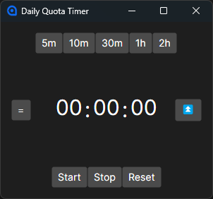

# Daily Quota Timer

It's a simple desktop timer that can be used for all kinds of timed activities on desktop.

### Features
- Setting time!
- Reducing time!
- Adding time!
- Notification when time's up!
- Being above all other windows!

Refer to the tooltips for more info on what each and every button does.

## Nerd stuff

Build using [dotnet 10](https://dotnet.microsoft.com/en-us/download/dotnet/10.0) and Avalonia.
To get started with the project, download the source code and execute `dotnet run` in the same directory as the source code.

In the current implementation, app only supports and targets windows due to how windows notification packages are structured.
Except that app can be ported to other platforms, if needed. (PRs welcome!)
